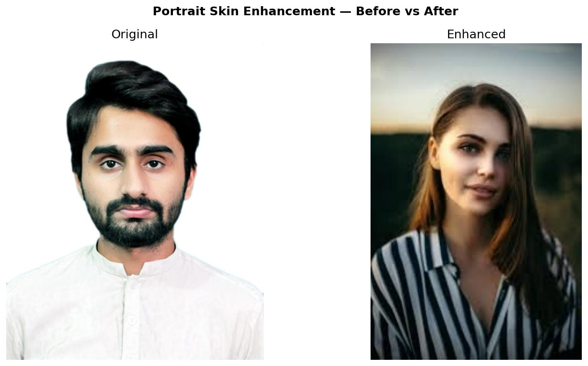

# Portrait Skin Enhancement

A traditional image-processing pipeline that enhances facial skin in portrait photos while preserving eyes, eyebrows, lips, hair, and beard naturally. Automatically detects skin tone and adjusts all parameters dynamically.

---

## Before vs After



---

## How It Works

```
Input Image
      ↓
Load & Convert Color Spaces (BGR → YCrCb → Grayscale)
      ↓
Face Detection (Haar Cascade)
      ↓
68 Facial Landmarks (Dlib)
      ↓
Auto Skin Tone Detection (Light / Medium / Dark)
      ↓
Skin Mask (YCrCb thresholding + morphology + feathering)
      ↓
Skin Smoothing (Guided Filter — edge preserving)
      ↓
Tone Enhancement (Histogram stretching on Y channel)
      ↓
Alpha Blend + Save Result
```

---

## Features

- Automatic skin tone detection — light, medium, dark
- Dynamic parameter tuning based on detected skin tone
- Edge-preserving smoothing using Guided Filter
- Brightness enhancement using histogram stretching
- Landmark-based protection of eyes, brows, and lips
- Feathered alpha blending for seamless natural result
- Works on any portrait photo

---

## Project Structure

```
portrait-skin-enhancement/
│
├── src/
│   ├── __init__.py
│   ├── loader.py        ← Step 1: load image, convert color spaces
│   ├── detector.py      ← Step 2: face detection (Haar Cascade)
│   ├── landmarks.py     ← Step 3: 68 facial landmarks (Dlib)
│   ├── skin_tone.py     ← Step 4: auto skin tone detection
│   ├── mask.py          ← Step 5: skin mask construction
│   ├── smoother.py      ← Step 6: guided filter smoothing
│   ├── tone.py          ← Step 7: histogram stretching
│   └── blender.py       ← Step 8: alpha blend and save
│
├── input/               ← put your portrait photos here
├── output/              ← enhanced results saved here
├── assets/              ← README images
│
├── main.py              ← run this to process a photo
├── requirements.txt     ← Python dependencies
├── Dockerfile           ← Docker container
└── .gitignore
```

---

## Technologies

| Library | Version | Purpose |
|---|---|---|
| Python | 3.11 | Language |
| OpenCV | 4.9.0 | Image processing, face detection |
| OpenCV-contrib | 4.9.0 | Guided Filter (ximgproc) |
| Dlib | 19.24.1 | 68-point facial landmarks |
| NumPy | 1.26.4 | Array operations |
| Matplotlib | 3.x | Visualization |

---

## Setup

### 1. Clone the repo
```bash
git clone https://github.com/MAetisamm/portrait-skin-enhancement.git
cd portrait-skin-enhancement
```

### 2. Create virtual environment
```bash
python -m venv venv

# Windows
venv\Scripts\activate

# Mac/Linux
source venv/bin/activate
```

### 3. Install dependencies
```bash
pip install -r requirements.txt
```

### 4. Windows users — dlib installation

Dlib requires a C++ compiler to build from source. On Windows the easiest solution is to install a pre-built wheel:

```bash
pip install https://github.com/z-mahmud22/Dlib_Windows_Python3.x/raw/main/dlib-19.24.1-cp311-cp311-win_amd64.whl
```

Then install the rest:
```bash
pip install opencv-python==4.9.0.80 opencv-contrib-python==4.9.0.80 numpy==1.26.4 matplotlib
```

### 5. Download dlib landmark model

The 68-point landmark model is required but too large for GitHub (100MB). Download it automatically:

```bash
python -c "
import urllib.request, bz2, shutil
print('Downloading landmark model...')
urllib.request.urlretrieve(
    'http://dlib.net/files/shape_predictor_68_face_landmarks.dat.bz2',
    'shape_predictor_68_face_landmarks.dat.bz2'
)
print('Extracting...')
with bz2.open('shape_predictor_68_face_landmarks.dat.bz2', 'rb') as f_in:
    with open('shape_predictor_68_face_landmarks.dat', 'wb') as f_out:
        shutil.copyfileobj(f_in, f_out)
print('Done!')
"
```

### 6. Add your photo

Copy any portrait photo into the `input/` folder and rename it `test.jpg`.

### 7. Run

```bash
python main.py
```

Result will be saved to `output/enhanced.jpg`.

---

## Docker

## Run with Docker

No Python installation needed — just Docker!

### Pull the image
docker pull aetisam/skin-enhancer:v1

### Run on Windows (PowerShell)
docker run --rm `
  -v C:\path\to\photos:/app/input `
  -v C:\path\to\results:/app/output `
  aetisam/skin-enhancer:v1 `
  --input /app/input/portrait.jpg `
  --output /app/output/enhanced.jpg

### Run on Mac/Linux
docker run --rm \
  -v ~/photos:/app/input \
  -v ~/results:/app/output \
  aetisam/skin-enhancer:v1 \
  --input /app/input/portrait.jpg \
  --output /app/output/enhanced.jpg

### What the flags mean
--rm                    → delete container after it finishes
-v ~/photos:/app/input  → mount your photos folder into container
-v ~/results:/app/output→ mount your results folder into container
--input                 → path to your portrait photo inside container
--output                → where to save the enhanced result---

## Parameters

All parameters are automatically tuned based on detected skin tone. You can also adjust them manually in `main.py`:

| Parameter | Location | Effect |
|---|---|---|
| `radius` | `smooth_skin()` | Smoothing strength — higher = more blur |
| `eps` | `smooth_skin()` | Edge preservation — lower = sharper edges |
| `strength` | `smooth_skin()` | Blend amount — 0.0 original, 1.0 fully smoothed |
| `brightness_boost` | `enhance_tone()` | Brightness level — 1.0 normal, 1.5 bright |

### Skin tone parameter defaults

| Skin tone | Radius | Strength | Brightness |
|---|---|---|---|
| Light | 4 | 0.55 | 1.5 |
| Medium | 3 | 0.50 | 1.5 |
| Dark | 2 | 0.40 | 1.5 |

---

## Landmark Reference

The 68-point Dlib model covers:

```
pts[0  - 16] → jawline        (17 points)
pts[17 - 21] → left eyebrow   ( 5 points)
pts[22 - 26] → right eyebrow  ( 5 points)
pts[27 - 35] → nose           ( 9 points)
pts[36 - 41] → left eye       ( 6 points)
pts[42 - 47] → right eye      ( 6 points)
pts[48 - 67] → lips           (20 points)
```

Eyes, brows, and lips are carved out from the skin mask so they are never smoothed or brightened.

---

## Known Limitations

- Works best on frontal face photos
- Requires clear face visibility — no heavy occlusion
- Beard area may be partially affected depending on skin tone
- Forehead not covered by 68-point landmark model but is included in skin mask via face bounding box
- Very dark or very bright lighting may affect skin tone detection accuracy

---

## References

- He K, Sun J, Tang X. Guided image filtering. IEEE TPAMI, 2012
- Liang L, Jin L, Li X. Facial skin beautification using adaptive region-aware masks. IEEE Transactions on Cybernetics, 2014
- Dlib 68-point landmark model: http://dlib.net/files/shape_predictor_68_face_landmarks.dat.bz2